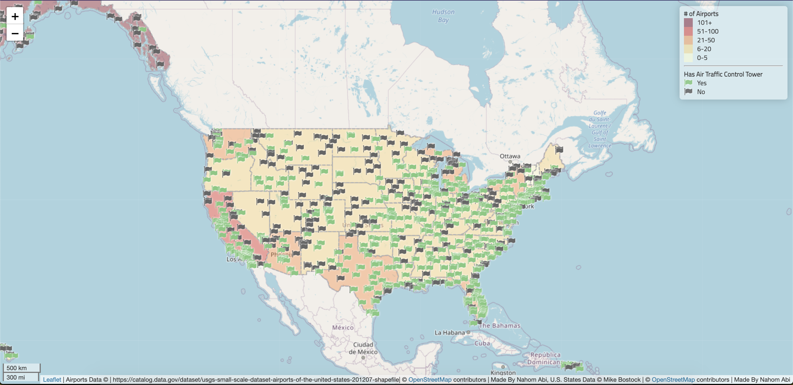

# Airports in the United States (GEOG 458 Lab Assignment)

This project is web application to visualize airports in the United States. As a user, you can explore airports located in each state by zooming (either with your mouse or the zoom control on the top left), panning using left-click, and clicking on each airport marker to find out its name.

Airports are indicated using a flag icon. A *green* flag indicates the airport has an air traffic control, while *black* indicates otherwise. Furthermore, there is a choropleth layer to show the number distribution of airports across states.

**Libraries used for the project**

* [Leaflet](https://leafletjs.com/)
* [Font Awesome](https://fontawesome.com/)
* [jQuery](https://jquery.com/)
* [chroma.js](https://gka.github.io/chroma.js/)

**Acknowledgment**

This project uses a basemap provided by OpenStreet through Leaflet, geojson data file containing all the states' boundaries provided by Mike Bostock, and [Airport data from here](https://catalog.data.gov/dataset/usgs-small-scale-dataset-airports-of-the-united-states-201207-shapefile).